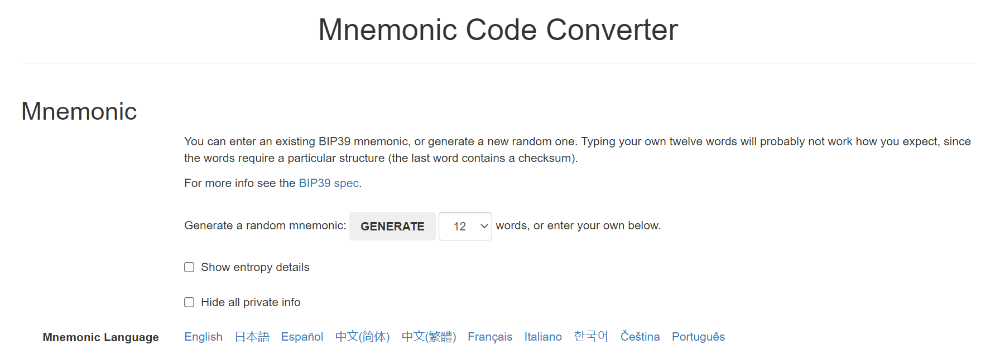
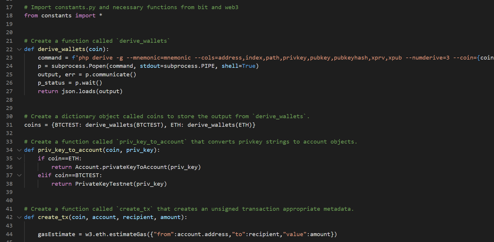
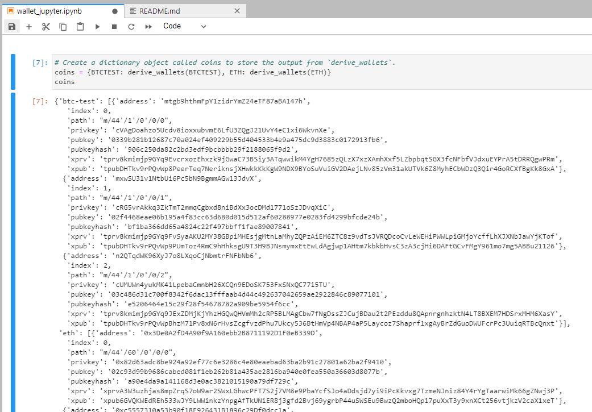
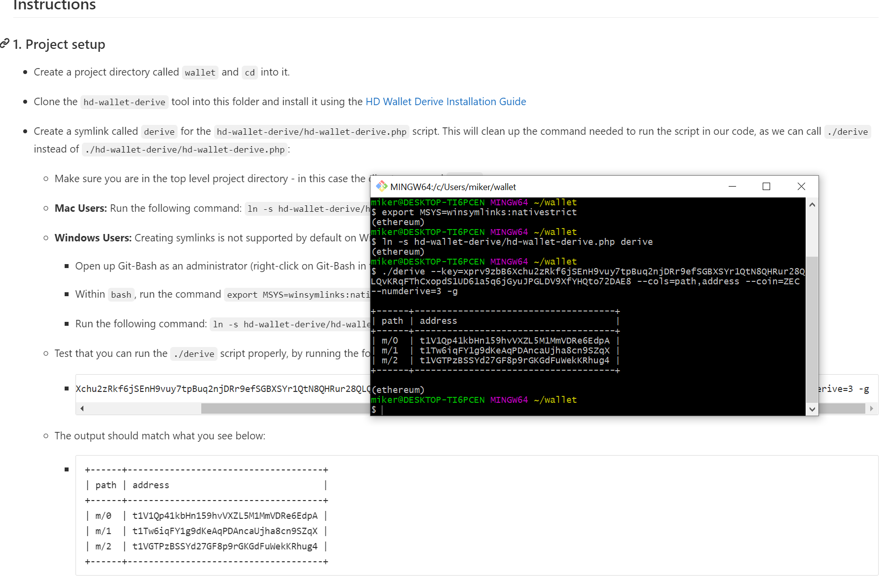
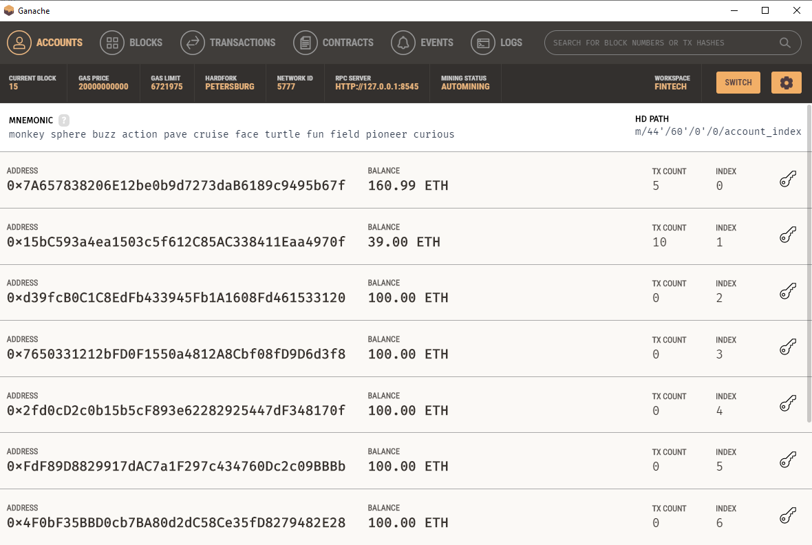

# Unit 19: Multi-Blockchain Wallet in Python

## Objective: Set up a multi-blockchain wallet using derive and code to utilise the keys.

### Workings:

- HD Wallet Derive set up
- Jupyter lab used for code to quickly debug then code moved to python file
- Mnemonic Code Converter: BIP39 (https://iancoleman.io/bip39/#english)
- Constants set up in Python
- Wallet set up
- Transaction set up for signing
- Ganache used for some testing of ETH
- Blockchain explorer used to check BTCTEST balances
- Test transactions sent

# Example screenshots below:

### BIP39 - Mnemonic

### Python Code

### Python Example

### Symlink

### Ganache Balances before test ETH transaction

### Ganache Balances after test ETH transaction (note 0.5 ETH transferred)

